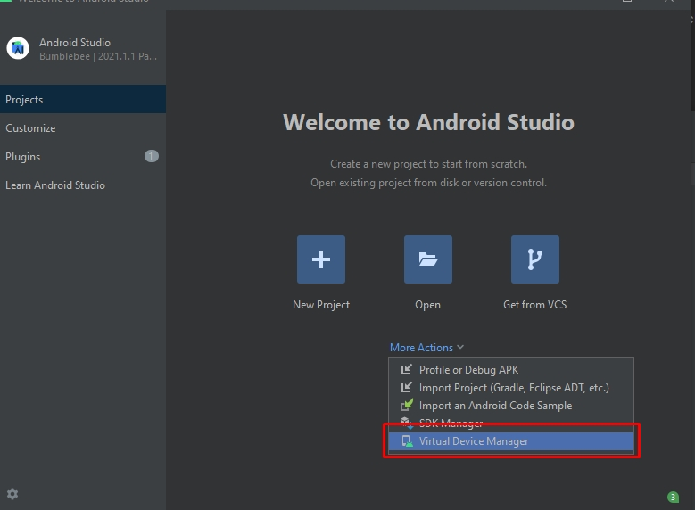
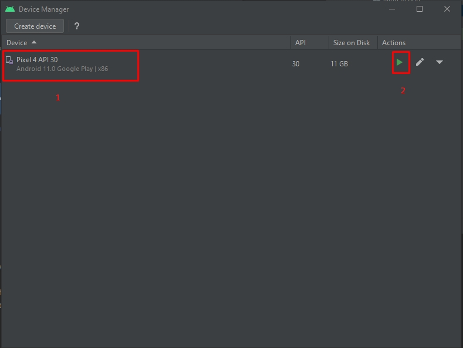
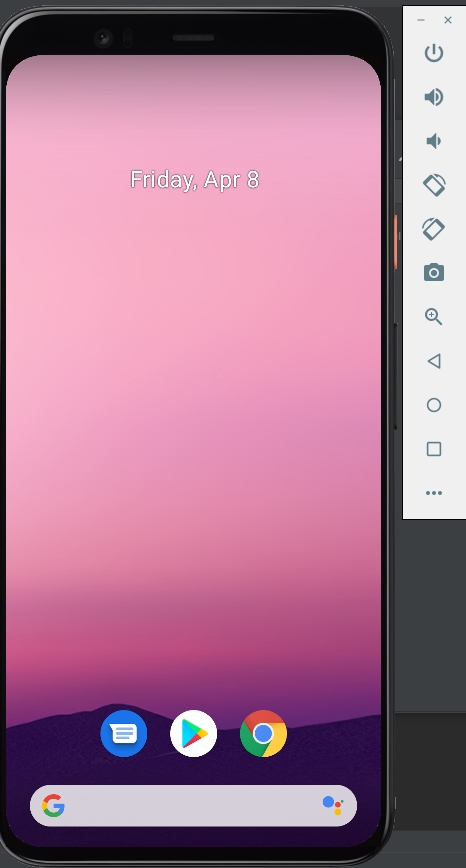
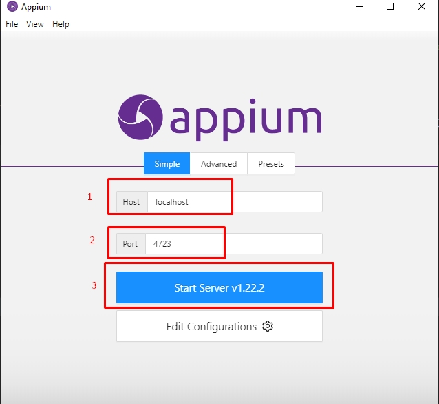
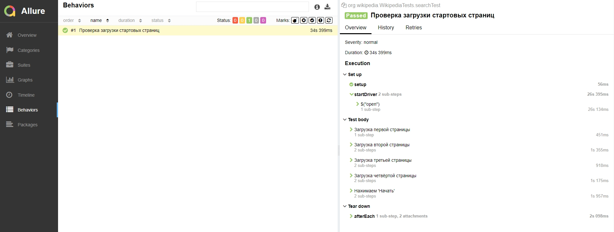
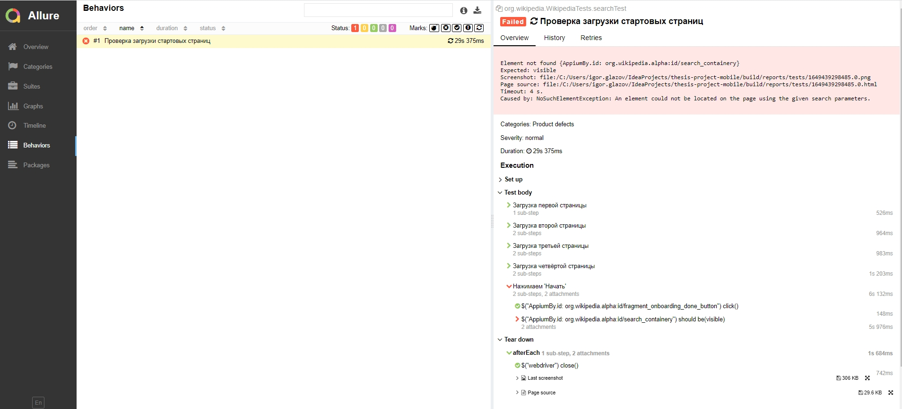
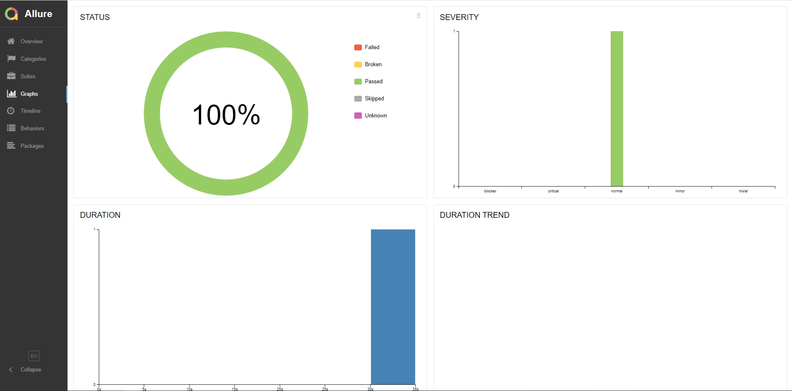

<h1>Проект по тестированию мобильного приложения Wikipedia.</h1>

<h2>:bookmark_tabs: Содержание</h2>

:eight_spoked_asterisk:	 Реализованные проверки

:eight_spoked_asterisk:	 Стек технологий

:eight_spoked_asterisk:	 Подготовка окружения и запуск тестов

:eight_spoked_asterisk:	 Отчет о результатах прохождения тестов в Allure Report

:eight_spoked_asterisk:	 Уведомления в Telegram с использованием бота

<h2>:eyes:	 Реализованные проверки</h2>

:black_medium_square: Проверка загрузки страниц ознакомления

:black_medium_square: Проверка загрузки главной страницы приложения

<h2>:books:	 Стек технологий</h2>


<p>


 


</p>


<h2>:arrow_forward:	 Подготовка окружения и запуск тестов</h2>
<p>Для запуска тестов используется реальное устройство или эмулятор реального устройства, запущенный с помощью <b>Android Studio</b></p>

<p><i>Чтобы запустиль эмулятор необходимо запустить Android Studio и выбрать <b>Virtual Device Manager</b>: </i>
</br>
</br>


<p><i>Если список устройств пуст, то необходимо создать устройство и запустить его: </i>
</br>
</br>


<p><i>Запущенный эмулятор выглядит следующим образом: </i>
</br>
</br>


<p><i>Далее необходимо запустить <b>Appium Server</b>: </i>
</br>
</br>


<h3>:large_blue_diamond:	 Процесс запуска тестов происходит так:</h3>

<p><i>В терминале Intelij_IDEA прописываем следующие команды, после которых запускаются тесты: </i>

```
gradle clean test
```
<p><i>Для отправки отчета в Телеграм, прописываем следующие команды: </i>

```
java  \
"-DprojectName=Local run" \
"-Denv=Testing" \
"-DreportLink=No link" \
"-Dcomm=Any comment here" \
"-Dconfig.file=./notifications/telegram_config_local.json" \
-jar ./notifications/allure-notifications-3.1.2.jar
```

<h2>:bar_chart:	 Отчет о результатах прохождения тестов в Allure TestOps</h2>

<h4>:small_orange_diamond:	 Страница с результатами пройденных проверок:</h4>

<p align="center">

</p>

<h4>:small_orange_diamond:	 Страница с результатами пройденных проверок, если есть оишбки:</h4>

<p align="center">

</p>

<h4>:small_orange_diamond:	 Страница с общими результатами тестирования в графическом виде:</h4>

<p align="center">

</p>


<h2>:mailbox_with_mail:	 Уведомления в Telegram с использованием бота</h2>
<p><i>После окончания работы скрипта в Телеграм отправляется уведомление с результатами. </i>
</br>
</br>

</p>
