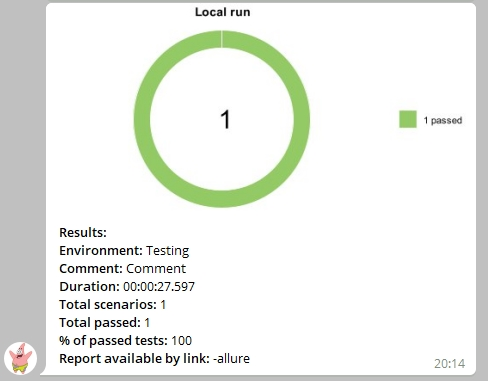

<h1>Проект по тестированию главной страницы интернет-магазина "Ситилинк".</h1>

<a target="_blank" href="https://www.citilink.ru/">Ссылка на сайт магазина</a>

<h2>:bookmark_tabs: Содержание</h2>

:eight_spoked_asterisk:	 Реализованные проверки

:eight_spoked_asterisk:	 Стек технологий

:eight_spoked_asterisk:	 Запуск тестов в Jenkins

:eight_spoked_asterisk:	 Отчет о результатах прохождения тестов в Allure TestOps

:eight_spoked_asterisk:	 Уведомления в Telegram с использованием бота

:eight_spoked_asterisk:	 Пример запуска теста в Selenoid

<h2>:eyes:	 Реализованные проверки</h2>

:black_medium_square: Проверка загрузки заголовка и его содержимого

:black_medium_square: Проверка загрузки нижнего колонтитула

:black_medium_square: Проверка наличия каталога товаров

:black_medium_square: Проверка работы поиска в каталоге товаров

<h2>:books:	 Стек технологий</h2>

 

 

<h2>:arrow_forward:	 Запуск тестов в Jenkins</h2>

Для запуска тестов используется инструмент CI/CD под названием <b>Jenkins</b>

<a target="_blank" href="https://jenkins.autotests.cloud/job/010-Bigwatch-thesis-project-UI/">Ссылка на задачу для запуска тестов</a>

<i>Параметры сборки выбираются при запуске задачи:<b></i>
 
 

<code>BROWSER</code> – браузер, в котором будут выполняться тесты.

<code>VERSION</code> – версия браузера, в которой будут выполняться тесты.

<code>COMMENT</code> – комментарий для сообщения в Телеграм.

<code>ENVIRONMENT</code> - среда, на которой прогоняются автотесты.

<h3>:large_blue_diamond:	 Процесс запуска происходит следующим образом:</h3>

<i>На странице сборки выбираем <b>"Собрать с параметрами"</b>: </i>
 
 

<i>Выбираем необходимые параметры запуска и нажимаем <b>"Собрать"</b>: </i>
 
 

<i>Результаты работы сборки можно посмотреть, нажав на значок "Allure TestOps"</b>: </i>
 
 

<h2>:bar_chart:	 Отчет о результатах прохождения тестов в Allure TestOps</h2>

<h4>:small_orange_diamond:	 Страница со списком всех пройденных проверок:</h4>

<h4>:small_orange_diamond:	 Страница со всеми запусками:</h4>

<h4>:small_orange_diamond:	 Дефект, описанный в результате запуска тестов:</h4>

<h4>:small_orange_diamond:	 Страница с общими результатами тестирования в графическом виде:</h4>

<h2>:mailbox_with_mail:	 Уведомления в Telegram с использованием бота</h2>

<i>После окончания сборки в Телеграм отправляется уведомление со ссылкой на отчёт. </i>
 
 

<h2>:cinema:	 Пример запуска теста в Selenoid</h2>

<i>К каждому тесту в отчете прилагается видео: </i>
 
 

